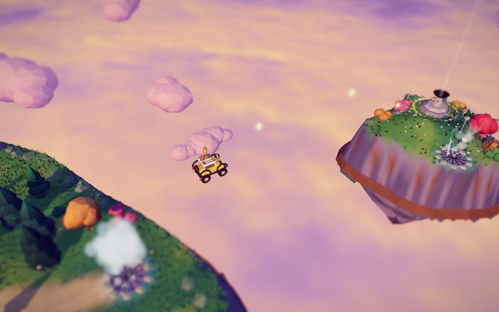
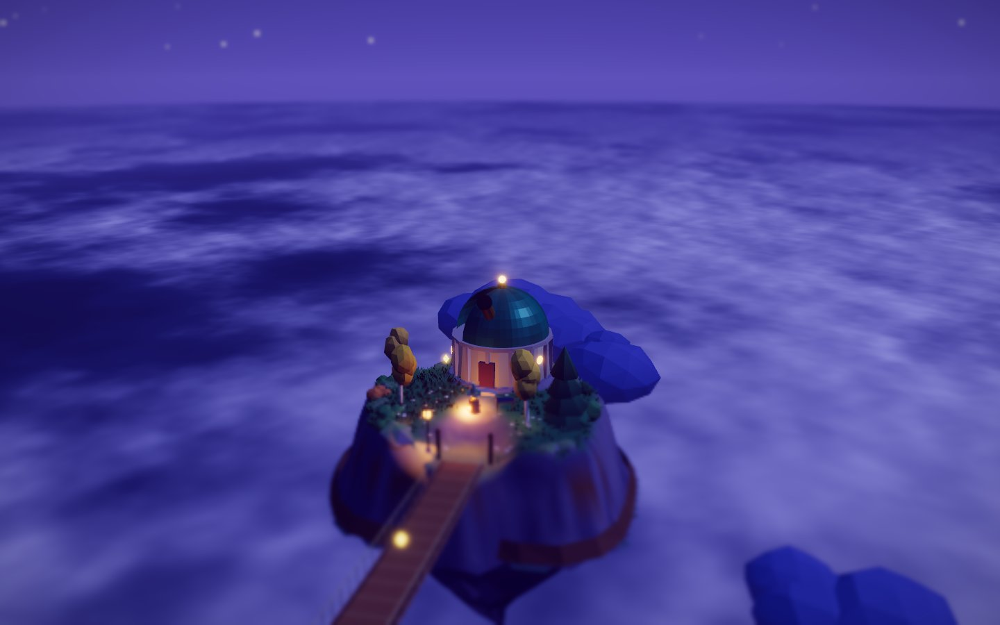
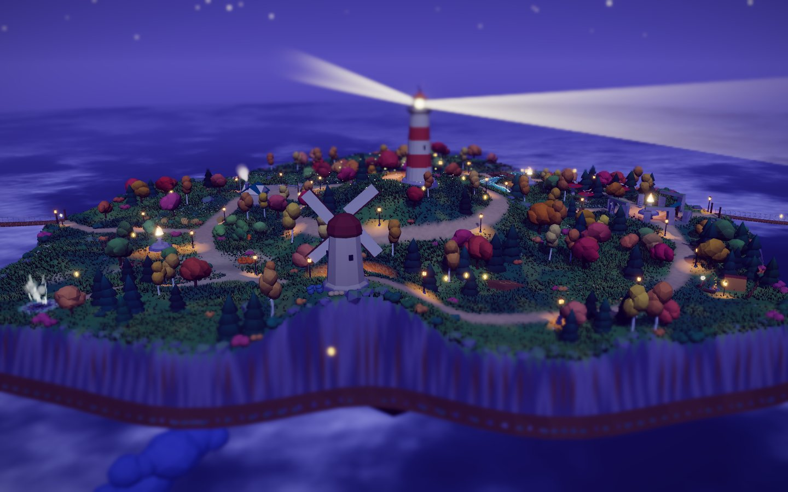
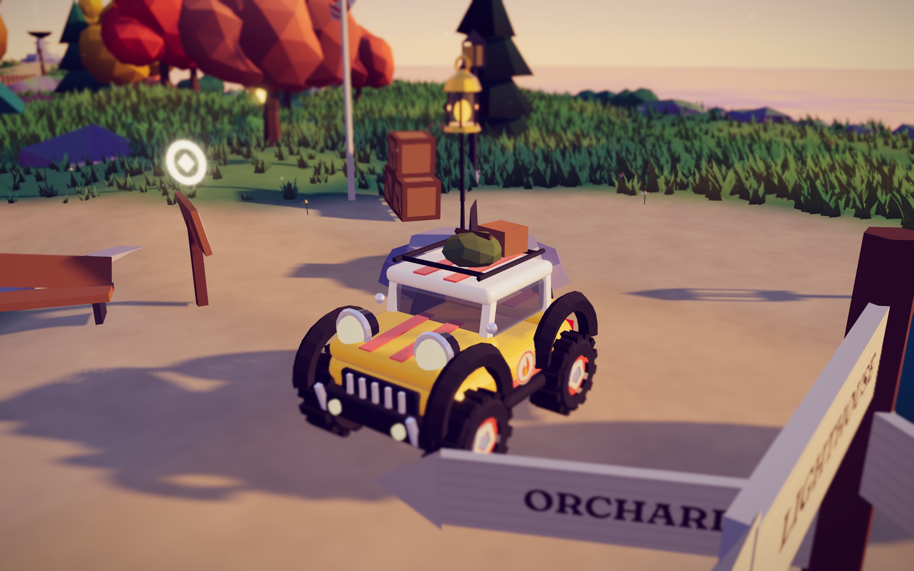
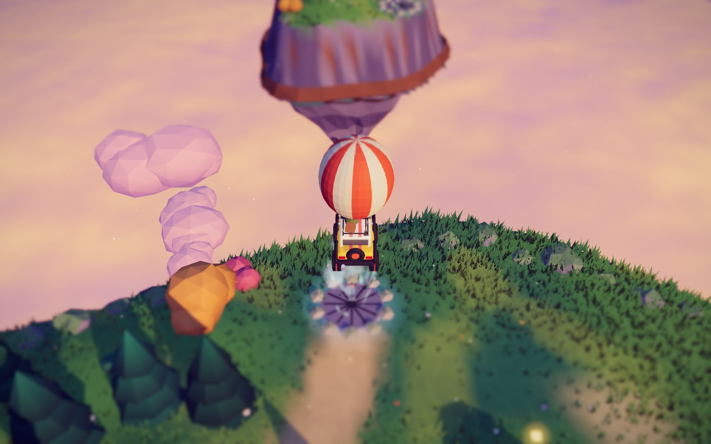

# Last Light

A small browser game about a floating archipelago at dusk.

Every evening the isle sinks a little lower into the clouds, and every evening Keeper Oriel lights its six beacons to lift it back up. Tonight, Oriel didn't come home. You drive **Wick**, a lantern buggy, guided by **Ember**, the little flame living in its lantern. Together you relight the beacons across three islands, fire up the lighthouse, and follow the light that answers to find Oriel.

Each beacon you light pushes the sky further from golden hour toward night.

Built with **Three.js + Rapier + TypeScript + Vite**. Every mesh, texture, shader and sound is generated in code. There are no model files, no image textures and no audio files.


| | |
|---|---|
|  |  |
|  |  |
|  |  |
|  |  |

## Deploy

The repo is ready for Vercel: import it and the framework is detected as Vite (see `vercel.json`). Build command `npm run build`, output `dist/`.

## Run it

```bash
npm install
npm run dev        # http://127.0.0.1:5199
npm run build      # static build in dist/ (deploy anywhere: Netlify, Vercel, GH Pages…)
npm run preview
```

Add `?play` to the URL to skip the title screen.

## Controls

| Key | Action |
|---|---|
| W A S D / arrows | drive |
| Shift | boost |
| Space | hop |
| E / Enter | read a keeper's note |
| R | reset / unstick (or rescue if you're off the map) |
| T | cycle time of day: story / golden / dusk / night |
| Enter | skip dialogue |
| M | map |
| N | mute |
| H | hide the controls card |
| Esc | pause (quality, sky, sound, music, respawn at last beacon, restart) |
| Mouse drag / wheel | orbit / zoom the camera |

## What's in the game

- **Story in four chapters.** Light the six beacons, then the lighthouse, then follow the light that blinks back to find Oriel on the Observatory isle. The epilogue cinematic lifts the isle out of the clouds. Ember (and later Oriel) speak in typed-out dialogue lines that react to what you do: your first fall, your first geyser ride, your first glimmer, getting stuck.
- **An archipelago:** the main isle plus three islets. **Far islet** and the **Observatory isle** hang off rope bridges. **Windward isle** is reached by riding a wind geyser that throws Wick on a ballistic arc across the void, and a second geyser throws you back.
- **Falling off the world is a feature.** The camera holds and watches Wick drop through the cloud sea. Then the lantern inflates into a little hot-air balloon and floats you back down onto the last safe spot.
- **Wick v2:** clear-coated paint, bug-eye headlights with a real night beam, chrome grille, glass cabin, roof rack with luggage, spare tyre and door roundels. The springy lantern antenna is still there.
- **Feel:** a boost with a kick, speed lines and FOV punch. Rope bridges have a frictionless deck that only moves vertically, so wheels never snag on them. An escalating anti-stuck routine frees the car from crate piles and corners on its own.
- **Sky control:** play the time of day as the story dictates, or force golden hour, dusk or night from the pause menu or the T key.
- **32 glimmers**, including two that hang in the geyser's flight path and one that only appears if you ring the stone-circle bell twice, plus **8 keeper's notes**.
- **Physical toys:** crate pyramids, barrels, hay bales, pumpkins, cairns, a giant beach ball, a pendulum bell, bouncy mushrooms and jump ramps.
- **The waterfall:** the river spills off the edge in a ballistic arc, and a camera hint swings out over the void to frame it.

## Architecture

```
src/
  main.ts                 entry; applies global shader patches
  game/game.ts            boot, main loop, story chapters, geysers, falls/rescue, FX/audio wiring
  game/story.ts           dialogue lines + typewriter dialogue player
  game/oriel.ts           Keeper Oriel (procedural character, waves at you)
  game/vehicle.ts         Rapier ray-cast vehicle + visual springs (roll, pitch, squash, antenna)
  game/props.ts           dynamic props
  game/objectives.ts      beacons, finale ring, glimmers
  core/physics.ts         fixed 60 Hz step with interpolation, contact-force events
  core/renderer.ts        WebGL2 + post stack, quality presets, dynamic resolution
  core/camera.ts          follow camera, look-ahead, authored "camera hint" zones, cinematics
  core/input.ts           keyboard / mouse
  core/shaderPatches.ts   NaN/Inf guard for the HDR post chain
  world/layout.ts         the hand-authored map: landmarks, roads, objectives, secrets
  world/terrain.ts        analytic height field → mesh, trimesh collider, heightmap texture
  world/assets.ts         geometry Builder (baked vertex colour, AO, wobble) + foliage wind shader
  world/foliage.ts        trees, rocks, bushes, flowers, ~95k instanced grass clumps
  world/structures.ts     lighthouse, windmill, hut, ruins, observatory, geysers, lamps, ramps…
  world/ropebridge.ts     kinematic rope bridges (vertical-only physics deck, swaying visuals)
  world/water.ts          depth-aware pond/river shader, waterfall sheet, lily pads, ripples
  world/atmosphere.ts     sky, sun/moon, time-of-day palette, cloud sea, island underside, birds
  fx/particles.ts         pooled point-sprite particles + ambient motes and fireflies
  fx/tracks.ts            fading tyre tracks
  audio/audio.ts          procedural Web Audio: engine, wind, water, SFX, generative score
  ui/ui.ts, style.css     HUD, modals, map
```

### Rendering

- **Lighting:** a directional sun (or moon) whose PCF shadow frustum follows the player and is texel-snapped to stop shimmering. A hemisphere light provides the coloured bounce: violet shadows, warm highlights.
- **Post-processing** (pmndrs `postprocessing`): mipmap bloom, then a tilt-shift pass for the miniature look, then a colour grade (lift, gain, saturation, exposure), ACES tone mapping and a light vignette. The scene renders into a half-float buffer with MSAA.
- **Time of day:** four palette keyframes covering sky, sun, hemisphere light, fog, clouds, water and exposure. The sun sets and the moon rises from the opposite side.
- **Grass:** one instanced draw per spatial chunk. Wind and the push-away-from-the-car effect run in the vertex shader, and the grass receives shadows. Far chunks are thinned out by distance.
- **X-ray dither on foliage:** canopies that come between the camera and Wick dissolve, so the car stays visible.

### Performance

The game picks HIGH, MEDIUM or LOW from the GPU name and you can change it in the pause menu. On top of the preset, **dynamic resolution** adjusts the pixel ratio to hold 60 fps. It only drops to a lower preset if the resolution is already at its floor. All foliage is instanced, all static architecture is merged into one mesh, and particles come from pools.

### Licensing

All code and generated content is original. The libraries are MIT or Apache-2.0 (three, @dimforge/rapier3d-compat, postprocessing). The fonts are Fraunces and Outfit from Google Fonts, both under the SIL Open Font License.
