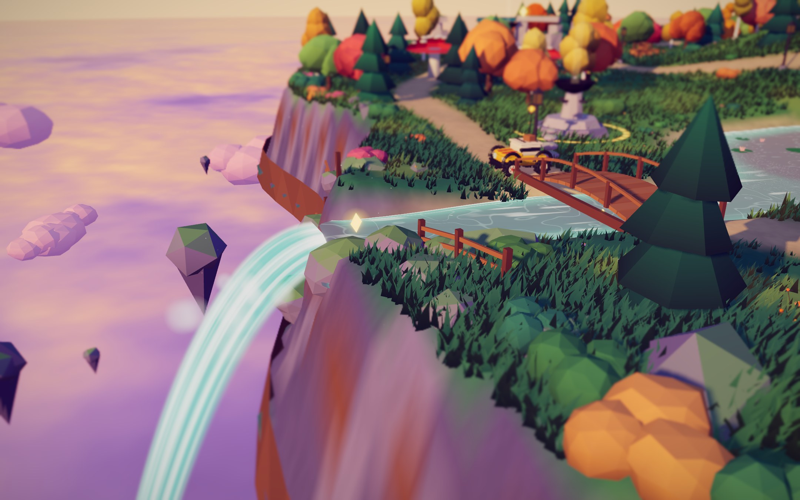
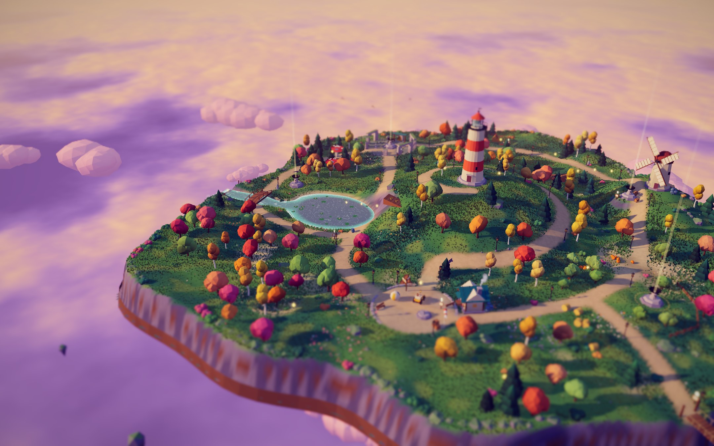
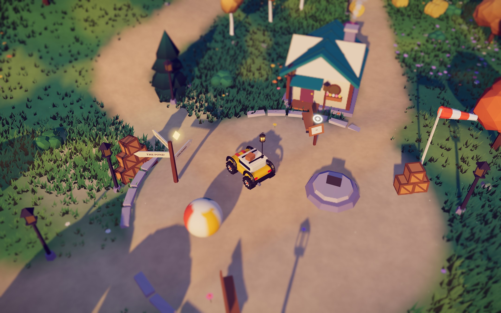
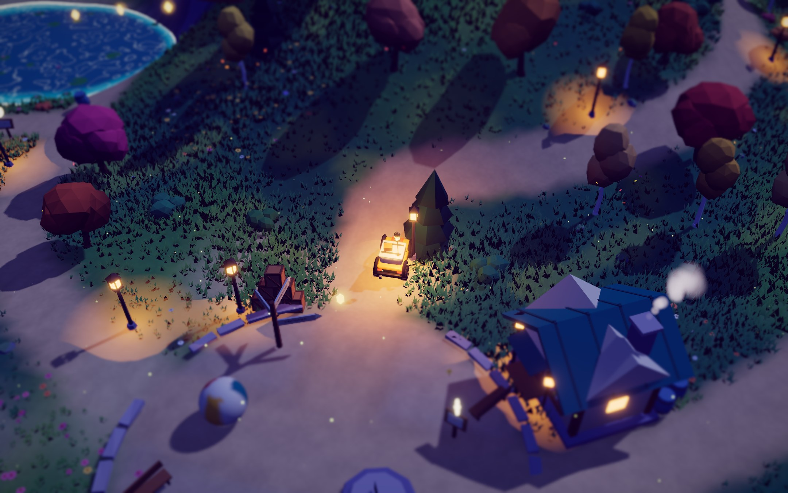

# Last Light

A small browser game about a floating island at dusk. You drive **Wick**, a lantern buggy, and relight five beacons before night falls. Each beacon you light pushes the sky further from golden hour toward night. Once all five are burning, you light the lighthouse.

Built with **Three.js + Rapier + TypeScript + Vite**. Every mesh, texture, shader and sound is generated in code. There are no model files, no image textures and no audio files.



| | |
|---|---|
|  |  |
|  | |

## Run it

```bash
npm install
npm run dev        # http://127.0.0.1:5199
npm run build      # static build in dist/ (deploy anywhere: Netlify, Vercel, GH Pages…)
npm run preview
```

Add `?play` to the URL to skip the title screen.

## Controls

| Key | Action |
|---|---|
| W A S D / arrows | drive |
| Shift | boost |
| Space | hop |
| E / Enter | read a keeper's note |
| R | respawn at last beacon |
| M | map |
| N | mute |
| H | hide the controls card |
| Esc | pause (quality, sound, music, restart) |
| Mouse drag / wheel | orbit / zoom the camera |

## What's on the island

- **5 beacons + the lighthouse finale.** Drive into a ring to kindle it. Each beacon moves the time of day along, switches on nearby street lamps, and adds a layer to the music.
- **26 glimmers** to collect. Some sit on top of jump arcs, on a mushroom cap, under a bridge, or on the waterfall lip, and one only appears if you ring the bell in the stone circle twice.
- **6 keeper's notes.** One of them is at a hidden camp on the north rim.
- **Physical toys:** crate pyramids, barrels, hay bales, pumpkins, stone cairns, a giant beach ball, a bell on a real pendulum joint, bouncy mushrooms, two jump ramps, and a rope bridge that sags and sways under the car.
- **The waterfall:** the river runs off the island's edge into the cloud sea. Near it, the camera swings out over the void to frame the shot.

## Architecture

```
src/
  main.ts                 entry; applies global shader patches
  game/game.ts            boot, main loop, state machine, objectives, FX/audio wiring
  game/vehicle.ts         Rapier ray-cast vehicle + visual springs (roll, pitch, squash, antenna)
  game/props.ts           dynamic props
  game/objectives.ts      beacons, finale ring, glimmers
  core/physics.ts         fixed 60 Hz step with interpolation, contact-force events
  core/renderer.ts        WebGL2 + post stack, quality presets, dynamic resolution
  core/camera.ts          follow camera, look-ahead, authored "camera hint" zones, cinematics
  core/input.ts           keyboard / mouse
  core/shaderPatches.ts   NaN/Inf guard for the HDR post chain
  world/layout.ts         the hand-authored map: landmarks, roads, objectives, secrets
  world/terrain.ts        analytic height field → mesh, trimesh collider, heightmap texture
  world/assets.ts         geometry Builder (baked vertex colour, AO, wobble) + foliage wind shader
  world/foliage.ts        trees, rocks, bushes, flowers, ~95k instanced grass clumps
  world/structures.ts     lighthouse, windmill, hut, ruins, bridges, lamps, ramps, mushrooms…
  world/water.ts          depth-aware pond/river shader, waterfall sheet, lily pads, ripples
  world/atmosphere.ts     sky, sun/moon, time-of-day palette, cloud sea, island underside, birds
  fx/particles.ts         pooled point-sprite particles + ambient motes and fireflies
  fx/tracks.ts            fading tyre tracks
  audio/audio.ts          procedural Web Audio: engine, wind, water, SFX, generative score
  ui/ui.ts, style.css     HUD, modals, map
```

### Rendering

- **Lighting:** a directional sun (or moon) whose PCF shadow frustum follows the player and is texel-snapped to stop shimmering. A hemisphere light provides the coloured bounce: violet shadows, warm highlights.
- **Post-processing** (pmndrs `postprocessing`): mipmap bloom, then a tilt-shift pass for the miniature look, then a colour grade (lift, gain, saturation, exposure), ACES tone mapping and a light vignette. The scene renders into a half-float buffer with MSAA.
- **Time of day:** four palette keyframes covering sky, sun, hemisphere light, fog, clouds, water and exposure. The sun sets and the moon rises from the opposite side.
- **Grass:** one instanced draw per spatial chunk. Wind and the push-away-from-the-car effect run in the vertex shader, and the grass receives shadows. Far chunks are thinned out by distance.
- **X-ray dither on foliage:** canopies that come between the camera and Wick dissolve, so the car stays visible.

### Performance

The game picks HIGH, MEDIUM or LOW from the GPU name and you can change it in the pause menu. On top of the preset, **dynamic resolution** adjusts the pixel ratio to hold 60 fps. It only drops to a lower preset if the resolution is already at its floor. All foliage is instanced, all static architecture is merged into one mesh, and particles come from pools.

### Licensing

All code and generated content is original. The libraries are MIT or Apache-2.0 (three, @dimforge/rapier3d-compat, postprocessing). The fonts are Fraunces and Outfit from Google Fonts, both under the SIL Open Font License.
